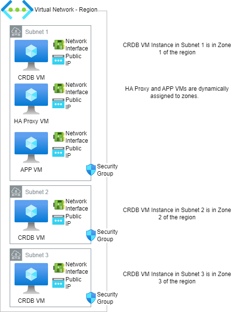
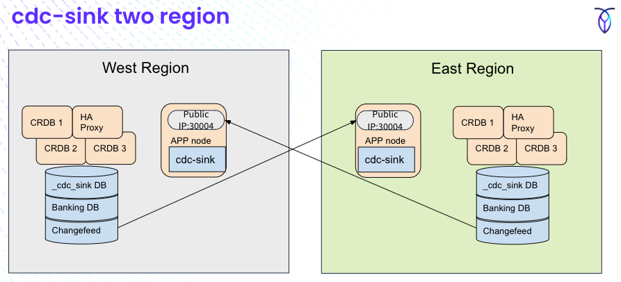

# AZURE-Terraform-CRDB-Module

## Outline
- [Security Notes](#security-notes) 
- [Using the Terraform HCL](#using-the-terraform-hcl)
  - [Run This Terraform Script](#run-this-terraform-script)
    - [Prepare to run](#prepare)
    - [For Enterprise Features](#if-you-intend-to-use-enterprise-features-of-the-database)
    - [Kick off the script](#kick-off-terraform-script)
  - [Deploy to 2 regions](#deploy-to-2-regions-with-cdc-sink)
    - [Run Terraform on each region](#run-terraform)
    - [Verify Deployments](#verify-deployment)
      - [Ensure cdc-sink running](#ensure-cdc-sink-is-running-on-each-region)
      - [Verify application running in each region](#verify-application-running-in-each-region)
    - [Deploy ChangeFeeds](#deploy-changefeeds)
  - [Technical Documentation](#technical-documentation)
    - [Azure Documentation](#azure-documentation)
      - [resize disk](#terraform-variable-crdbresizehomelv)
      - [Finding Images](#finding-images)
      - [Install Terraform](#install-terraform) 
      - [Install Azure CLI](#install-azure-cli)
      - [Azure Links](#azure-links)
    - [Terraform/Ansible Description](#terraformansible-documentation)
    - [cdc-sink](#cdc-sink-replicator)
      - [cdc-sink links](#cdc-sink-links)



Terraform HCL to create a multi-node CockroachDB cluster in Azure.   The number of nodes can be a multiple of 3 and nodes will be evenly distributed between 3 Azure Zones.   Optionally, you can include
 - haproxy VM - the proxy will be configured to connect to the cluster
 - app VM - application node that includes software for a multi-region demo

## Security Notes
- `firewalld` has been disabled on all nodes (cluster, haproxy and app).   
- A security group is created and assigned with ports 22, 8080 and 26257 opened to a single IP address.  The address is configurable as an input variable (my-ip-address)  

## Using the Terraform HCL
To use the HCL, you will need to define an Azure SSH Key -- that will be used for all VMs created to provide SSH access.

### Run this Terraform Script
```terraform
# See the appendix below to intall Terrafrom, the Azure CLI and logging in to Azure

git clone https://github.com/nollenr/AZURE-Terraform-CRDB-Module.git
cd AZURE-Terraform-CRDB-Module/
```

#### if you intend to use enterprise features of the database
```
export TF_VAR_cluster_organization={CLUSTER ORG}
export TF_VAR_enterprise_license={LICENSE}
```
#### Prepare
* Use the terraform/ansible deployment using the subdirectories [region1](region1) and/or [region2](region2) in the deployment github
* Can disable deployment of Kafka by setting the *include_ha_proxy* flag to "no" in [deploy main.tf](region1/main.tf)
* Ensure *install_cdc_sink* flag and *create_cdc_sink* flag are set to true in [main.yml](provisioners/roles/app-node/vars/main.yml)
* Ensure *install_enterprise_keys* is set in [main.tf](region1/main.tf)
* Depending on needs, decide whether to deploy kafka setting the *include_kafka* to yes or no in [main.tf](region1/main.tf)
* Look up the IP address of your client workstation and put that IP address in *my_ip_address*
  * This allows your client workstation to access the nodes through their public IP address
  * This access is needed for the ansible scripts to perform necessary operations
* *NOTE:* Inside the application node, this [banking java application](https://github.com/jphaugla/CockroachDBearch-Digital-Banking-CockroachDB) will be deployed and configured

#### Kick off terraform script
modify [main.tf](region1/main.tf)
```
cd region1
terraform init
terraform plan
export OBJC_DISABLE_INITIALIZE_FORK_SAFETY=YES
terraform apply
```

To clean up and remove everything that was created

```
terraform destroy
```
## Deploy to 2 regions with cdc-sink

### Run Terraform
*  terraform apply in each region directory-reference the steps [noted above](#run-this-terraform-script)
```bash
export TF_VAR_cluster_organization={CLUSTER ORG}
export TF_VAR_enterprise_license={LICENSE}
git clone https://github.com/nollenr/AZURE-Terraform-CRDB-Module.git
cd AZURE-Terraform-CRDB-Module/region1
terraform init
export OBJC_DISABLE_INITIALIZE_FORK_SAFETY=YES
terraform apply
cd AZURE-Terraform-CRDB-Module/region2
terraform init
export OBJC_DISABLE_INITIALIZE_FORK_SAFETY=YES
terraform apply
```
### Verify deployment
* This will deploy this [Digital-Banking-CockroachDB github](https://github.com/jphaugla/CockroachDBearch-Digital-Banking-CockroachDB) into the application node with connectivity to cockroachDB.  
  Additionally, cdc-sink is deployed and running on the application node also with connectivity to haproxy and cockroachDB in the same region 

#### Ensure cdc-sink is running on each region
```bash
cd ~/AZURE-Terraform-CRDB-Module/provisioners/temp/{region_name}
ssh -i path_to_ssh_file adminuser@`cat app_external_ip.txt`
ps -ef |grep cdc-sink
# if it is not running, start it
cd /opt/cdc-sink-linux-amd64-master
./start.sh
```
#### Verify application running in each region
*  NOTE:  this compiling and starting of the application step has been automated in terraform so only for debug/understanding
* The java application needs to be started manually on the application node for each region.  Set up the [environment file](scripts/setEnv.sh)
  * the ip addresses can be found in a subdirectory under [temp](provisioners/temp) for each deployed region
  * Make sure to set the COCKROACH_HOST environment variable to the private IP address for the haproxy node
  * If using kafka, KAFKA_HOST should be set to the internal IP address for kafka
  * set the REGION to the correct region
* do on each region
```bash
# NOTE: this should already be running.  If not running check log files in /mnt/datat1/bank-app
# steps below will rerun
cd ~/AZURE-Terraform-CRDB-Module/provisioners/temp/{region_name}
ssh -i path_to_ssh_file adminuser@`cat app_external_ip.txt`
cd Digital-Banking-CockroachDB
# edit scripts/setEnv.sh as documented above
source scripts/setEnv.sh
mvn clean package
java -jar target/cockroach-0.0.1-SNAPSHOT.jar
```

### Deploy changefeeds
* The necessary manual step is to deploy a [CockroachDB Changefeed](https://www.cockroachlabs.com/docs/stable/create-changefeed) across the regions to make active/active cdc-sink between the two otherwise independent regions
  * Port 30004 is open on both regions to allow the changefeed to communicate with the application server on the other region
* Start the changefeed on each side with changfeed pointing to the other sids's application external IP address
* The changefeed script is written on each of the cockroach database nodes by the terraform script.  Login to any of the cockroach
  nodes using the IP address in [temp](provisioners/temp) for each deployed region.
  * As previously mentioned, the changefeed script must be modified to point to the application external IP address for the other region
  * this is the step that reaches across to the other region as everything else is within region boundaries
* IMPORTANT NOTE:  Must have enterprise license for the changefeed to be enabled
  * see [changefeed documentation](https://www.cockroachlabs.com/docs/stable/licensing-faqs#set-a-license)
```bash
cd ~/AZURE-Terraform-CRDB-Module/provisioners/temp/{region_name}
ssh -i path_to_ssh_file adminuser@`cat crdb_external_ip{any ip_address}`
# edit create-changefeed.sh putting the app node external IP address for the other region
cockroach sql --host=localhost --certs-dir=certs
SET CLUSTER SETTING cluster.organization = 'Acme Company';
SET CLUSTER SETTING enterprise.license = 'xxxxxxxxxxxx';
exit
vi changefeed.sh
./changefeed.sh
```
Verify rows are flowing across from either region by running additional [test application steps](https://github.com/jphaugla/CockroachDBearch-Digital-Banking-CockroachDB/test-application)

## Technical Documentation

### Azure Documentation
#### terraform variable crdb_resize_homelv
In Azure, any additional space allocated to a disk beyond the size of the image, is available but unused.  Setting the variable `crdb_resize_homelv` to "yes", will cause the user_data script to attempt to resize the home logical volume to take advantage of the additional space.  This is potentially dangerous and should only be used if you're sure that sda2 is the volume group with the homelv partition.  Typically, if you're using the standard redhat source image defined in by the instance.tf you should be fine.

#### Finding images
```
az vm image list -p "Canonical"
az vm image list -p "Microsoft"
```

#### Install Terraform
sudo yum install -y yum-utils
sudo yum-config-manager --add-repo https://rpm.releases.hashicorp.com/AmazonLinux/hashicorp.repo
sudo yum -y install terraform

#### Install Azure CLI
sudo rpm --import https://packages.microsoft.com/keys/microsoft.asc
for RHEL 8
sudo dnf install -y https://packages.microsoft.com/config/rhel/8/packages-microsoft-prod.rpm
sudo dnf install azure-cli

az upgrade
az version
az login (directs you to a browser login with a code -- once authenticated, your credentials will be displayed in the terminal)

#### Azure Links:
Microsoft Terraform Docs
https://learn.microsoft.com/en-us/azure/virtual-machines/linux/quick-create-terraform
Sizes for VM machines (not very helpful)
https://learn.microsoft.com/en-us/azure/virtual-machines/sizes
User Data that is a static SH 
https://github.com/guillermo-musumeci/terraform-azure-vm-bootstrapping-2/blob/master/linux-vm-main.tf


### Terraform/Ansible Documentation
* [terraform.tfvars](terraform.tfvars) and [vars.tf](vars.tf) have important parameters.  
* Each node type has its own tf file
  * [application node *app.tf*](app.tf)
  * [kafka node *kafka.tf*](kafka.tf)
  * [haproxy node *haproxy.tf*](haproxy.tf)
  * [cockroachDB node *instance.tf*](instance.tf)
* Network components including security groups with port permissions are in [network.tf](network.tf)
* Can use either of the regions subdirectories to kick off the deployment.  Both regions are defined to enable cdc-sink deployment
  * [region1](region1/main.tf) 
  * [region2](region2/main.tf)
* These files connect terraform and ansible
  * template file at [inventory.tpl](templates/inventory.tpl)
  * [provisioning.tf](provisioning.tf) 
  * [inventory.tf](inventory.tf)
* Ansible code is in the [provisioners/roles](provisioners/roles) subdirectory
  * [playbook.yml](provisioners/playbook.yml) 
  * Each node group has a subdirectory under [provisioners/roles](provisioners/roles)
    * Each node group has ansible code to export the node's private and public ip addresses to a region subdirectory under [provisioners/temp](provisioners/temp)
    * [haproxy-node](provisioners/roles/haproxy-node)  doesn't have any additional installation
    * [app-node](provisioners/roles/app-node) creates an application node running cdc-sink and a Digital Banking java application
      * cdc-sink is [installed](provisioners/roles/app-node/tasks/install-cdc-sink.yml) and [started](provisioners/roles/app-node/tasks/create-cdc-sink.yml)
        * cdc-sink needs [node.js installed](provisioners/roles/app-node/tasks/install-nodejs-typescript.yml)
      * banking java application is [installed](provisioners/roles/app-node/tasks/package-java-app.yml) and [started](provisioners/roles/app-node/tasks/start-java-app.yml)
        * banking java application needs these tasks to run as well:
          * [java installed](provisioners/roles/app-node/tasks/install-java-maven-go.yml)
          * [make der certs](provisioners/roles/app-node/tasks/create-der-certs.yml)
          * [ensure git installed](provisioners/roles/app-node/tasks/install-git.yml) and [bank github cloned](provisioners/roles/app-node/tasks/add-githubs.yml)
    * [kafka-node](provisioners/roles/kafka-node)
      * [confluent installed](provisioners/roles/kafka-node/tasks/confluent-install.yml)
      * [confluent connect plug-ins](provisioners/roles/kafka-node/tasks/confluent-connect-plug.yml)
      * [confluent start](provisioners/roles/kafka-node/tasks/confluent-start.yml)
      * [confluent add connectors](provisioners/roles/kafka-node/tasks/confluent-add-connectors.yml)
    * [crdb-node](provisioners/roles/crdb-node)
      * For using cdc-sink, a changefeed script is [created](provisioners/roles/kafka-node/tasks/main.yml) using a [j2 template](provisioners/roles/crdb-node/templates/create-changefeed.j2)
  * Under each of these node groups
    * A vars/main.yml file has variable flags to enable/disable processing
    * A tasks/main.yml calls the required tasks to do the actual processing
    * A templates directory has j2 files allowing environment variable and other substitution
## cdc-sink (replicator)

This is a schematic of the cdc-sink deployment.  Within region, the nodes only use the private IPs to connect.  
The only port needed to be opened between the regions is the port for cdc-sink running on the application node (30004).  The changefeed from 
the other region will have this application nodes public IP address in its webhook address.
### cdc-sink links
* [cockroachDB create changefeed](https://www.cockroachlabs.com/docs/stable/create-changefeed)
* [cdc-sink github](https://github.com/cockroachdb/cdc-sink)
* [cdc-sink docker hub](https://hub.docker.com/r/cockroachdb/cdc-sink/tags)
* [active-active Docker deployment](https://github.com/cockroachdb/cdc-sink/tree/master/scripts/active_active)

## To tear it all down
NOTE:  on teardown, may see failures on delete of some azure components.  Re-running the destroy command is an option but sometime a force delete is needed on the OS disk drives of some nodes
```bash
terraform destroy
```
